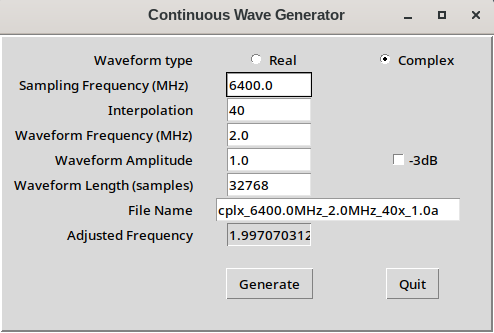

# wavegen

Continuous Wave Generator

This Python/Tk script helps generate a binary file and human-readable text file waveforms with the given characteristics.

### Running

The script requires Python3 with Tkinter module, which should come with all Python3 installations by default. It will also need the matplotlib module.
On Fedora 36, I had to install the modules with the following:

    $ sudo dnf install python3-tkinter
    $ pip install matplotlib

To run the script:

    $ python3 wavegen.py

### Input:

- All numeric fields are interpreted in decimal values.
- The Real/Complex checkbox selects whether to generate one waveform or two (i.e. I and Q) in the output file.
- The sampling and waveform frequency fields are in MegaHertz units.
- The waveform amplitude is the gain applied to the function.
- The -3dB checkbox applies a 0.707 amplitude and ignores the amplitude field.
- The length field is how many samples to generate in the file.
- The filename field is automatically generated based on the options.
- The adjusted frequency is the closest value to the requested waveform frequency.

### Buttons:

- Generate: Generates the two output files (.txt & .bin) with the filename shown in the field. The fields are saved in a configuration file wavegen.ini for later usage.
- Quit: Exits the application, abandoning any edits.

